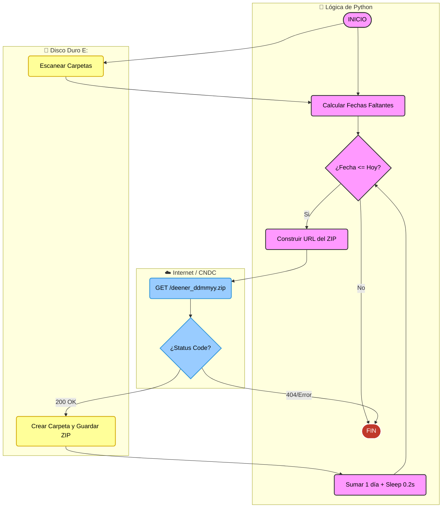

```mermaid
flowchart TD
    %% --- ESTILOS VISUALES (Clases CSS) ---
    classDef python fill:#f9f,stroke:#333,stroke-width:2px,color:black,rx:5,ry:5
    classDef disk fill:#ff9,stroke:#d4ac0d,stroke-width:2px,color:black,rx:5,ry:5
    classDef cloud fill:#9cf,stroke:#3498db,stroke-width:2px,color:black,rx:5,ry:5
    classDef endNode fill:#c0392b,stroke:#fff,stroke-width:2px,color:white,rx:10,ry:10

    %% --- CARRIL 1: TU CÓDIGO ---
    subgraph SCRIPT [🐍 Lógica de Python]
        direction TB
        Start([INICIO]) --> CalcDate[Calcular Fechas Faltantes]
        CalcDate --> Loop{¿Fecha <= Hoy?}
        
        Loop -- No --> End([FIN])
        Loop -- Si --> BuildUrl[Construir URL del ZIP]
        NextDay[Sumar 1 día + Sleep 0.2s]
    end

    %% --- CARRIL 2: INTERNET ---
    subgraph WEB [☁️ Internet / CNDC]
        direction TB
        BuildUrl --> Request(GET /deener_ddmmyy.zip)
        Request --> CheckStatus{¿Status Code?}
    end

    %% --- CARRIL 3: TU PC ---
    subgraph DISCO [💾 Disco Duro E:]
        direction TB
        Scan[Escanear Carpetas]
        Write[Crear Carpeta y Guardar ZIP]
    end

    %% --- CONEXIONES ENTRE CARRILES ---
    Start --> Scan
    Scan --> CalcDate
    
    CheckStatus -- 200 OK --> Write
    Write --> NextDay
    NextDay --> Loop
    
    CheckStatus -- 404/Error --> End

    %% --- APLICACIÓN DE ESTILOS ---
    class Start,CalcDate,Loop,BuildUrl,NextDay python
    class Scan,Write disk
    class Request,CheckStatus cloud
    class End endNode
```