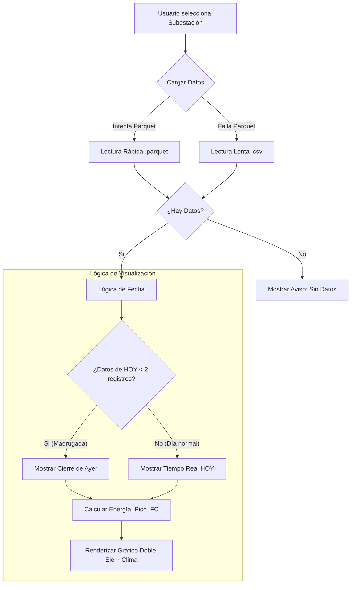

```mermaid
flowchart TD
    Start[Usuario selecciona Subestación] --> LoadData{Cargar Datos}
    
    LoadData -->|Intenta Parquet| Parquet[Lectura Rápida .parquet]
    LoadData -->|Falla Parquet| CSV[Lectura Lenta .csv]
    
    Parquet & CSV --> CheckEmpty{¿Hay Datos?}
    
    CheckEmpty -- No --> Warn[Mostrar Aviso: Sin Datos]
    CheckEmpty -- Si --> CalcLogic[Lógica de Fecha]
    
    subgraph Lógica de Visualización
        CalcLogic --> CheckToday{¿Datos de HOY < 2 registros?}
        CheckToday -- Si (Madrugada) --> ShowYesterday[Mostrar Cierre de Ayer]
        CheckToday -- No (Día normal) --> ShowToday[Mostrar Tiempo Real HOY]
        
        ShowYesterday & ShowToday --> KPIs[Calcular Energía, Pico, FC]
        KPIs --> Render[Renderizar Gráfico Doble Eje + Clima]
    end
```